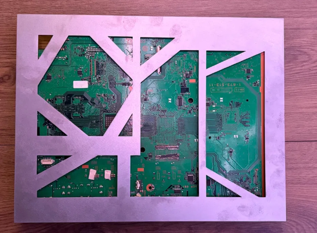
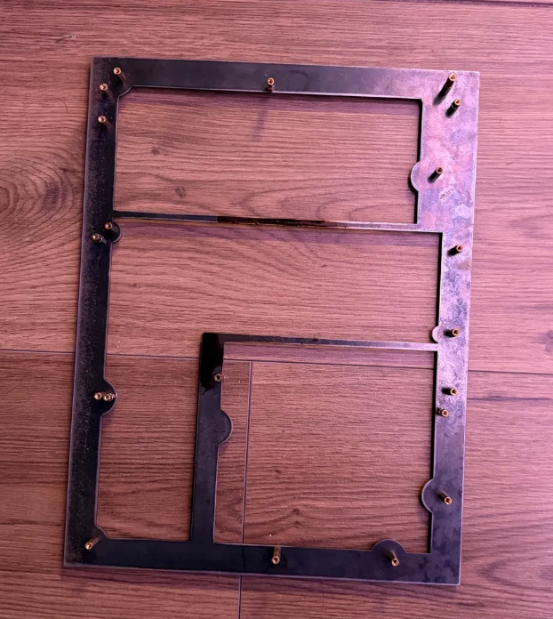
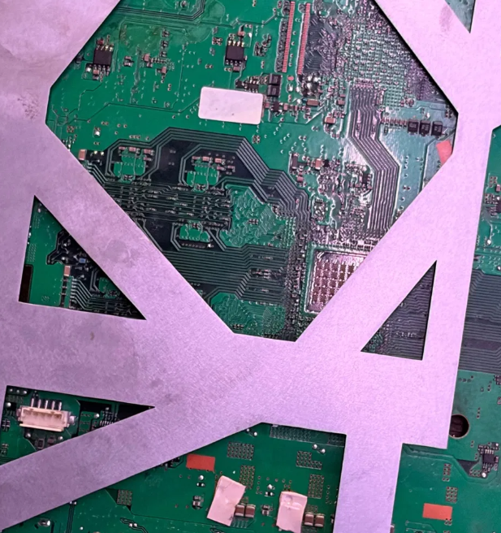
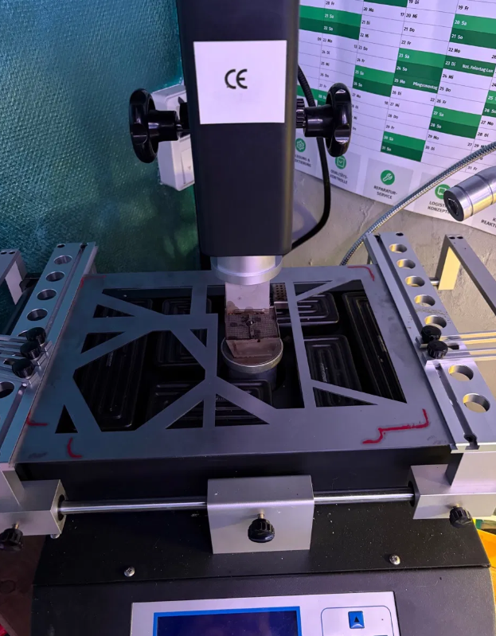

# NostaJig PS3

> A PS3 BGA rework jig designed to prevent board flex and 21 20 errors during RSX reflow.

---

## The Problem

The PS3JIGV2wtf_Are_calipers is widely used for PS3 BGA rework. It has a structural flaw.

At the board clamping section, the jig narrows to a thin strip. Under reflow
temperatures this section deflects, pulling the board down at the RSX footprint
during soak and reflow. The result is lifted solder balls at the BGA perimeter -
on boards that were fine going in.

This manifests as Syscon error **21 20** after rework. The jig caused it.

*PS3JIGV2wtf_Are_calipers - the thin section at the board edge deflects under heat*

---

## NostaJig PS3

Designed from scratch to eliminate warp-induced board flex and shield the
capacitor zone near the Cell during RSX rework.

*The cutout geometry shields the NEC/TOKIN capacitor area from direct heater exposure*

### Improvements over PS3JIGV2wtf_Are_calipers

| | PS3JIGV2wtf_Are_calipers | NostaJig PS3 |
|---|---|---|
| Warp under reflow temps | Present | Eliminated |
| Board edge clamping stability | Marginal | Reinforced |
| Cell / NEC-TOKIN zone shielding | None | Integrated |
| RSX ball lift risk | Real | Significantly reduced |

### Specs

- Material: 1.5 mm steel
- Two-part design - top plate and support frame
- Triangulated cutout geometry for thermal expansion distribution
- Compatible with standard IR/hot-air rework station beds (Honton HT-490 and similar)

---

## Files

`PS3JIG_CALIPERS_ARE_BETTER.stp` - send it wherever you want. Local laser cutter,
online sheet metal service, whatever. 1.5 mm steel, no special finish required.

---

## Usage

1. Place the bottom support frame on the rework station bed
2. Seat the PS3 mainboard, component side up
3. Apply the top plate, align to board edges
4. Clamp per your station's procedure
5. Run your RSX reflow profile as normal

*Seated in the Honton HT-490 - board held flat across the full RSX footprint*

---

## Background

After tracing enough post-rework 21 20 errors back to jig flex rather than
the reflow profile, this was built to remove that variable. The board needs
to stay flat.

---

## License

Design files provided for personal and non-commercial repair use.
Resale of manufactured jigs requires written permission from NostaMods.

---

*NostaMods - [github.com/jw0710](https://github.com/jw0710)*
